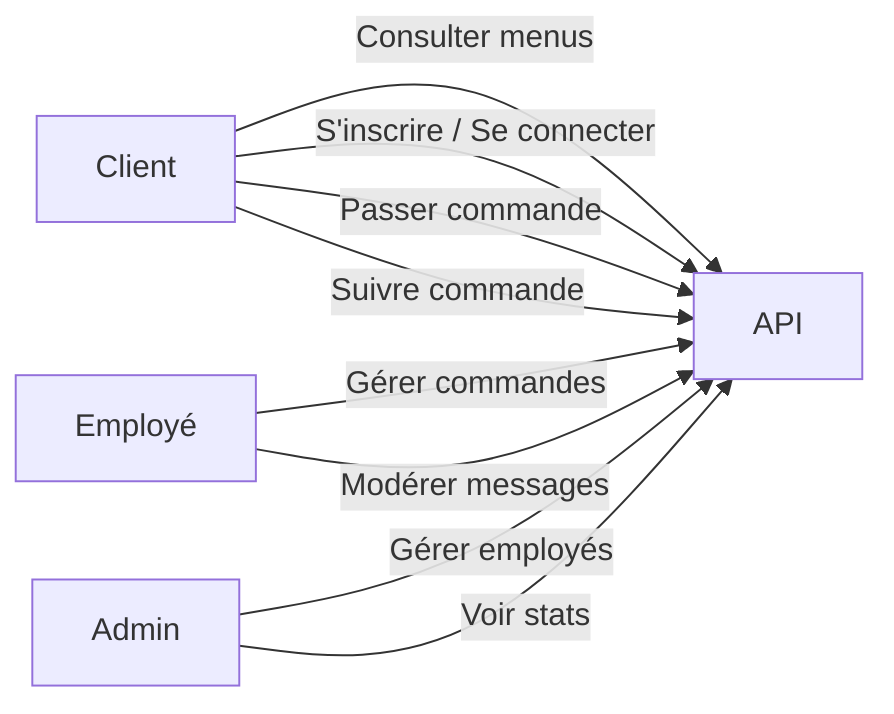
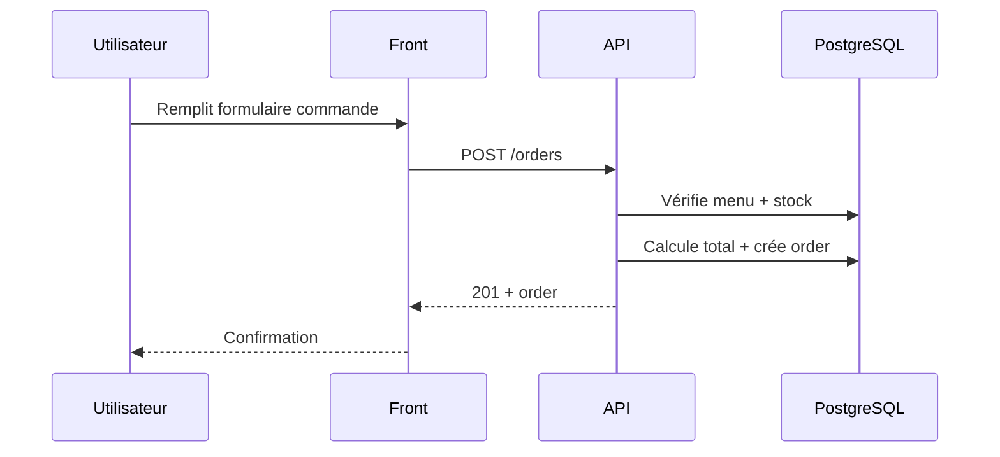
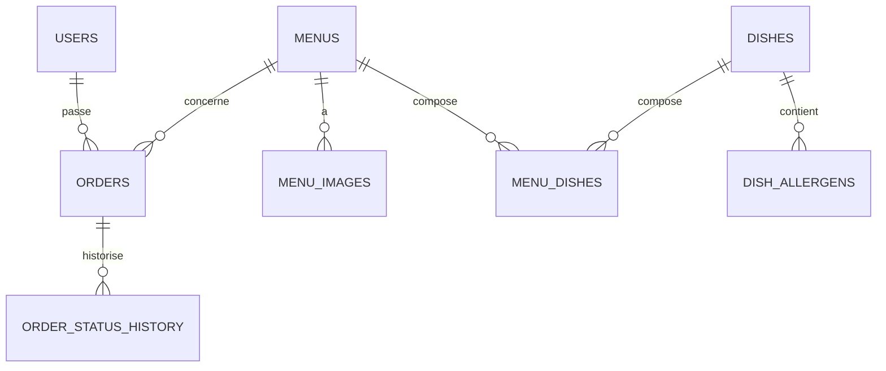

# Diagrammes (Mermaid)

## Cas d’utilisation (simplifié)

```mermaid
flowchart LR
  Client[Client] -->|Consulter menus| API[API]
  Client -->|S'inscrire / Se connecter| API
  Client -->|Passer commande| API
  Client -->|Suivre commande| API

  Employe[Employé] -->|Gérer commandes| API
  Employe -->|Modérer messages| API

  Admin[Admin] -->|Gérer employés| API
  Admin -->|Voir stats| API
```

## Séquence — création de commande (simplifiée)

```mermaid
sequenceDiagram
  participant U as Utilisateur
  participant F as Front
  participant A as API
  participant DB as PostgreSQL

  U->>F: Remplit formulaire commande
  F->>A: POST /orders
  A->>DB: Vérifie menu + stock
  A->>DB: Calcule total + crée order
  A-->>F: 201 + order
  F-->>U: Confirmation
```

## Modèle (ER) minimal

```mermaid
erDiagram
  USERS ||--o{ ORDERS : passe
  MENUS ||--o{ ORDERS : concerne
  MENUS ||--o{ MENU_IMAGES : a
  MENUS ||--o{ MENU_DISHES : compose
  DISHES ||--o{ MENU_DISHES : compose
  DISHES ||--o{ DISH_ALLERGENS : contient
  ORDERS ||--o{ ORDER_STATUS_HISTORY : historise
```
